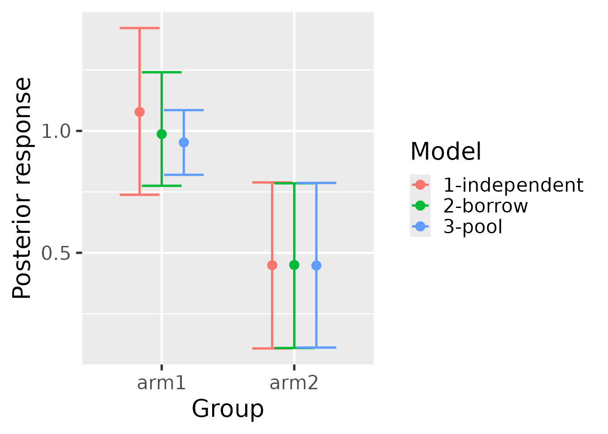
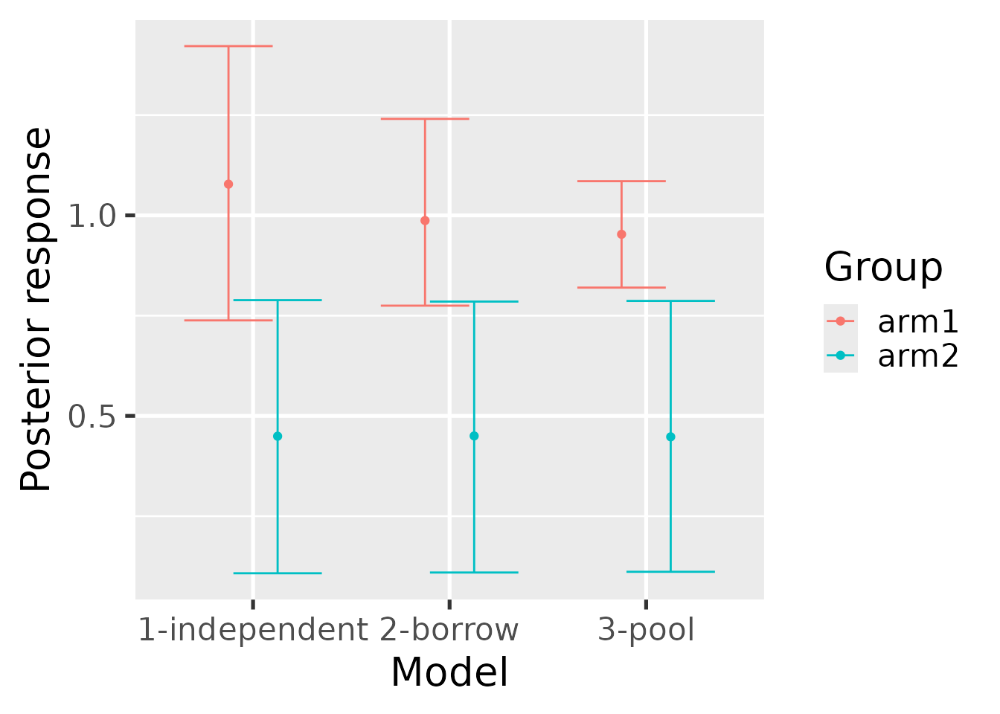
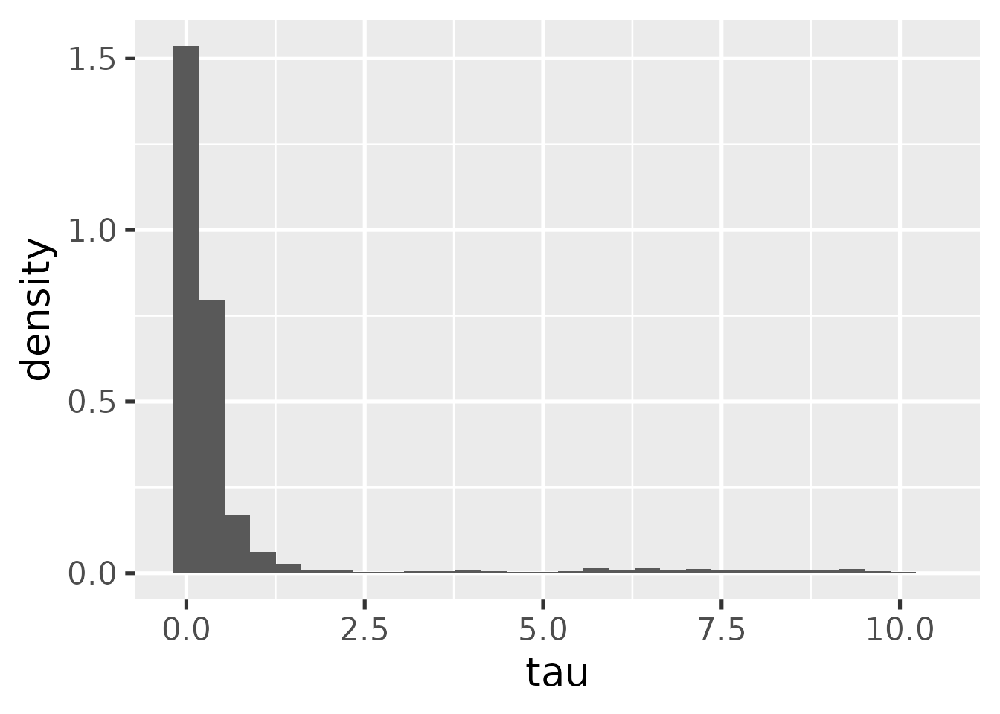

# Usage

This tutorial shows how to fit historical control-group borrowing models
using the `historicalborrow` package.

## Data

`historicalborrow` expects data on multiple patients partitioned into
studies and groups. Here is a simulated example. There are functions to
simulate from the prior predictive distribution of each of the
hierarchical, mixture, independent, and pooled models.

``` r
library(historicalborrow)
library(dplyr)
set.seed(0)
data <- hb_sim_independent(
  n_continuous = 1,
  n_study = 3,
  n_group = 2,
  alpha = rep(1, 3),
  delta = 0.5,
  sigma = rep(1, 3),
  n_patient = 100
)$data %>%
  rename(
    outcome = response,
    trial = study,
    arm = group,
    subject = patient,
    factor1 = covariate_study1_continuous1,
    factor2 = covariate_study2_continuous1
  ) %>%
  mutate(
    trial = paste0("trial", trial),
    arm = paste0("arm", arm),
    subject = paste0("subject", subject)
  )
data
#> # A tibble: 400 × 7
#>    trial  arm   subject    factor1 factor2 covariate_study3_continuous1 outcome
#>    <chr>  <chr> <chr>        <dbl>   <dbl>                        <dbl>   <dbl>
#>  1 trial1 arm1  subject1   1.27          0                            0  3.31  
#>  2 trial1 arm1  subject2   0.415         0                            0  3.23  
#>  3 trial1 arm1  subject3  -1.54          0                            0 -3.08  
#>  4 trial1 arm1  subject4  -0.929         0                            0 -0.623 
#>  5 trial1 arm1  subject5  -0.295         0                            0  2.33  
#>  6 trial1 arm1  subject6  -0.00577       0                            0  1.12  
#>  7 trial1 arm1  subject7   2.40          0                            0  5.88  
#>  8 trial1 arm1  subject8   0.764         0                            0  2.69  
#>  9 trial1 arm1  subject9  -0.799         0                            0 -0.0117
#> 10 trial1 arm1  subject10 -1.15          0                            0  0.261 
#> # ℹ 390 more rows
```

You as the user will choose a reference level of the `study` column to
indicate which study is the current one (the other are historical).
Likewise, you will choose a level of the `group` column to indicate
which group is the control group. To see how `historicalborrow` assigns
numeric indexes to the study and group levels, use
[`hb_data()`](https://wlandau.github.io/historicalborrow/reference/hb_data.md).
Viewing this output may assist with interpreting the results later on.

``` r
library(dplyr)
standardized_data <- hb_data(
  data = data,
  response = "outcome",
  study = "trial",
  study_reference = "trial3",
  group = "arm",
  group_reference = "arm1",
  patient = "subject",
  covariates = c("factor1", "factor2")
)
standardized_data
#> # A tibble: 400 × 9
#>    response study_label group_label patient_label study group patient
#>       <dbl> <chr>       <chr>       <chr>         <int> <int>   <int>
#>  1    3.31  trial1      arm1        subject1          1     1       1
#>  2    0.261 trial1      arm1        subject10         1     1       2
#>  3    1.81  trial1      arm1        subject100        1     1       3
#>  4   -1.21  trial1      arm1        subject11         1     1      13
#>  5    0.236 trial1      arm1        subject12         1     1      24
#>  6    1.02  trial1      arm1        subject13         1     1      35
#>  7    2.72  trial1      arm1        subject14         1     1      46
#>  8    0.485 trial1      arm1        subject15         1     1      57
#>  9    1.83  trial1      arm1        subject16         1     1      68
#> 10    0.357 trial1      arm1        subject17         1     1      79
#> # ℹ 390 more rows
#> # ℹ 2 more variables: covariate_factor1 <dbl>, covariate_factor2 <dbl>
```

``` r
distinct(
  standardized_data,
  study,
  study_label,
  group,
  group_label
) %>%
  select(
    study,
    study_label,
    group,
    group_label
  )
#> # A tibble: 4 × 4
#>   study study_label group group_label
#>   <int> <chr>       <int> <chr>      
#> 1     1 trial1          1 arm1       
#> 2     2 trial2          1 arm1       
#> 3     3 trial3          1 arm1       
#> 4     3 trial3          2 arm2
```

## Models

The pooled and independent models are benchmarks used to quantify the
borrowing strength of the hierarchical and mixture models. To run these
benchmark models, run the functions below. Each function returns a data
frame with one column per parameter and one row per posterior sample.

``` r
mcmc_pool <- hb_mcmc_pool(
  data = data,
  response = "outcome",
  study = "trial",
  study_reference = "trial3",
  group = "arm",
  group_reference = "arm1",
  patient = "subject",
  # Can be continuous, categorical, or binary columns:
  covariates = c("factor1", "factor2"),
  # Raise these arguments for serious analyses:
  n_chains = 4,
  n_adapt = 2e3,
  n_warmup = 2e3,
  n_iterations = 4e3
)

mcmc_pool
#> # A tibble: 16,000 × 10
#>    alpha `beta[1]` `beta[2]`  delta `sigma[1]` `sigma[2]` `sigma[3]` .chain
#>    <dbl>     <dbl>     <dbl>  <dbl>      <dbl>      <dbl>      <dbl>  <int>
#>  1 0.951      1.31  -0.174   0.313        1.07      1.02        1.66      1
#>  2 0.822      1.41  -0.0920  0.0491       1.09      0.895       1.72      1
#>  3 0.908      1.33  -0.216   0.345        1.05      0.934       1.72      1
#>  4 0.956      1.43  -0.118   0.229        1.00      0.944       1.72      1
#>  5 0.977      1.20  -0.170   0.572        1.06      0.996       1.70      1
#>  6 0.983      1.42  -0.0678  0.230        1.06      1.06        1.71      1
#>  7 1.02       1.38   0.0449  0.141        1.14      1.03        1.94      1
#>  8 0.909      1.34   0.00974 0.833        1.11      1.06        1.78      1
#>  9 0.817      1.30  -0.0706  0.275        1.40      0.967       1.78      1
#> 10 1.03       1.42  -0.288   0.162        1.33      0.927       1.75      1
#> # ℹ 15,990 more rows
#> # ℹ 2 more variables: .iteration <int>, .draw <int>
```

``` r
mcmc_independent <- hb_mcmc_independent(
  data = data,
  response = "outcome",
  study = "trial",
  study_reference = "trial3",
  group = "arm",
  group_reference = "arm1",
  patient = "subject",
  # Can be continuous, categorical, or binary columns:
  covariates = c("factor1", "factor2"),
  # Raise these arguments for serious analyses:
  n_chains = 4,
  n_adapt = 2e3,
  n_warmup = 2e3,
  n_iterations = 4e3
)
```

The hierarchical model works best if the number of historical studies is
large. For a small number of historical studies, it may be necessary to
choose a value of `s_tau` to approximate the prior amount of borrowing
given a desired precision ratio and supposed residual variance. See the
function
[`hb_s_tau()`](https://wlandau.github.io/historicalborrow/reference/hb_s_tau.md)
for an initial value to explore. It is not recommended to entirely rely
on
[`hb_s_tau()`](https://wlandau.github.io/historicalborrow/reference/hb_s_tau.md),
but it does give a benchmark to aid in the thinking.

``` r
mcmc_hierarchical <- hb_mcmc_hierarchical(
  data = data,
  response = "outcome",
  study = "trial",
  study_reference = "trial3",
  group = "arm",
  group_reference = "arm1",
  patient = "subject",
  # Can be continuous, categorical, or binary columns:
  covariates = c("factor1", "factor2"),
  # Raise these arguments for serious analyses:
  n_chains = 4,
  n_adapt = 2e3,
  n_warmup = 2e3,
  n_iterations = 4e3
)
```

For the mixture model, it is first necessary to use the simple model to
get prior mixture components.

``` r
hyperparameters <- hb_mcmc_mixture_hyperparameters(
  data = data,
  response = "outcome",
  study = "trial",
  study_reference = "trial3",
  group = "arm",
  group_reference = "arm1",
  patient = "subject"
)
hyperparameters
#> # A tibble: 3 × 4
#>   study  study_index m_omega s_omega
#>   <chr>        <int>   <dbl>   <dbl>
#> 1 trial1           1   0.982  0.177 
#> 2 trial2           2   0.892  0.0975
#> 3 trial3           3   0     30
```

Then, using just the data from the current study, run the mixture model
with the hyperparameters above.

``` r
data_mixture <- dplyr::filter(data, trial == "trial3")
mcmc_mixture <- hb_mcmc_mixture(
  data = data_mixture, # only analyze current study
  response = "outcome",
  study = "trial",
  study_reference = "trial3",
  group = "arm",
  group_reference = "arm1",
  patient = "subject",
  # Can be continuous, categorical, or binary columns:
  covariates = c("factor1", "factor2"),
  # Prior mixture components:
  m_omega = hyperparameters$m_omega,
  s_omega = hyperparameters$s_omega,
  p_omega = rep(1 / nrow(hyperparameters), nrow(hyperparameters)),
  # Raise these arguments for serious analyses:
  n_chains = 4,
  n_adapt = 2e3,
  n_warmup = 2e3,
  n_iterations = 4e3
)
```

## Convergence

It is important to check convergence diagnostics on each model. The
[`hb_convergence()`](https://wlandau.github.io/historicalborrow/reference/hb_convergence.md)
function returns data frame of summarized convergence diagnostics.
`max_rhat` is the maximum univariate Gelman/Rubin potential scale
reduction factor over all the parameters of the model, `min_ess_bulk` is
the minimum bulk effective sample size over the parameters, and
`min_ess_tail` is the minimum tail effective sample size. `max_rhat`
should be below 1.01, and the ESS metrics should both be above 100 times
the number of MCMC chains. If any of these conditions are not true, the
MCMC did not converge, and it is recommended to try running the model
for more saved iterations (and if `max_rhat` is high, possibly more
warmup iterations).

``` r
hb_convergence(mcmc_hierarchical)
#> # A tibble: 1 × 3
#>   max_rhat min_ess_bulk min_ess_tail
#>      <dbl>        <dbl>        <dbl>
#> 1     1.07         42.9         11.5
```

## Results

Each model can be summarized with the
[`hb_summary()`](https://wlandau.github.io/historicalborrow/reference/hb_summary.md)
function. The output is a table with few rows and many columns.

``` r
summary_hierarchical <- hb_summary(
  mcmc = mcmc_hierarchical,
  data = data,
  response = "outcome",
  study = "trial",
  study_reference = "trial3",
  group = "arm",
  group_reference = "arm1",
  patient = "subject",
  covariates = c("factor1", "factor2"),
  eoi = c(0, 1),
  direction = c(">", "<")
)
summary_hierarchical
#> # A tibble: 2 × 40
#>   group group_label data_n data_N data_n_study_1 data_n_study_2 data_n_study_3
#>   <dbl> <chr>        <int>  <int>          <int>          <int>          <int>
#> 1     1 arm1           300    300            100            100            100
#> 2     2 arm2           100    100              0              0            100
#> # ℹ 33 more variables: data_N_study_1 <int>, data_N_study_2 <int>,
#> #   data_N_study_3 <int>, data_mean <dbl>, data_sd <dbl>, data_lower <dbl>,
#> #   data_upper <dbl>, response_mean <dbl>, response_variance <dbl>,
#> #   response_sd <dbl>, response_lower <dbl>, response_upper <dbl>,
#> #   response_mean_mcse <dbl>, response_sd_mcse <dbl>,
#> #   response_lower_mcse <dbl>, response_upper_mcse <dbl>, diff_mean <dbl>,
#> #   diff_lower <dbl>, diff_upper <dbl>, diff_mean_mcse <dbl>, …
```

[`hb_summary()`](https://wlandau.github.io/historicalborrow/reference/hb_summary.md)
returns a tidy data frame with one row per group (e.g. treatment arm)
and the columns in the following list. Unless otherwise specified, the
quantities are calculated at the group level. Some are calculated for
the current (non-historical) study only, while others pertain to the
combined dataset which includes all historical studies. The mixture
model is an exception because the `data` argument only includes the
current study, so other quantities that include historical information
will need to borrow from an
[`hb_summary()`](https://wlandau.github.io/historicalborrow/reference/hb_summary.md)
call on one of the other models.

- `group`: group label.
- `data_mean`: observed mean response specific to the current study.
- `data_sd`: observed standard deviation of the response specific to the
  current study.
- `data_lower`: lower bound of a simple frequentist 95% confidence
  interval of the observed mean specific to the current study.
- `data_upper`: upper bound of a simple frequentist 95% confidence
  interval of the observed mean specific to the current study.
- `data_n`: number of non-missing observations in the combined dataset
  with all studies.
- `data_N`: total number of observations (missing and non-missing) in
  the combined dataset with all studies.
- `data_n_study_*`: number of non-missing observations separately for
  each study. The suffixes of these column names are integer study
  indexes. Call
  `dplyr::distinct(hb_data(your_data), study, study_label)` to see which
  study labels correspond to these integer indexes. Note: the combined
  dataset for the mixture model is just the current study. If all the
  `data_n_study_*` results across all studies are desired, then call
  [`hb_summary()`](https://wlandau.github.io/historicalborrow/reference/hb_summary.md)
  on a different model (e.g. pooled).
- `data_N_study_*`: same as `data_n_study_*` except both missing and
  non-missing observations are counted (total number of observations).
- `response_mean`: Estimated posterior mean of the response from the
  model specific to the current study. Typically, the raw response is
  change from baseline, in which case `response_mean` is estimating
  change from baseline.
- `response_sd`: Estimated posterior standard deviation of the mean
  response from the model specific to the current study.
- `response_variance`: Estimated posterior variance of the mean response
  from the model specific to the current study.
- `response_lower`: Lower bound of a 95% posterior interval on the mean
  response from the model specific to the current study.
- `response_upper`: Upper bound of a 95% posterior interval on the mean
  response from the model specific to the current study.
- `response_mean_mcse`: Monte Carlo standard error of `response_mean`.
- `response_sd_mcse`: Monte Carlo standard error of `response_sd`.
- `response_lower_mcse`: Monte Carlo standard error of `response_lower`.
- `response_upper_mcse`: Monte Carlo standard error of `response_upper`.
- `diff_mean`: Estimated treatment effect from the model specific to the
  current study.
- `diff_lower`: Lower bound of a 95% posterior interval on the treatment
  effect from the model specific to the current study.
- `diff_upper`: Upper bound of a 95% posterior interval on the treatment
  effect from the model specific to the current study..
- `diff_mean_mcse`: Monte Carlo standard error of `diff_mean`.
- `diff_lower_mcse`: Monte Carlo standard error of `diff_lower`.
- `diff_upper_mcse`: Monte Carlo standard error of `diff_upper`.
- `P(diff > EOI)`, `P(diff < EOI)`: CSF probabilities on the treatment
  effect specified with the `eoi` and `direction` arguments. Specific to
  the current study.
- `effect_mean`: Estimated posterior mean of effect size (treatment
  difference divided by residual standard deviation). Specific to the
  current study.
- `effect_lower`: Lower bound of a 95% posterior interval of effect size
  from the model. Specific to the current study.
- `effect_upper`: Upper bound of a 95% posterior interval of effect size
  from the model. Specific to the current study.
- `precision_ratio`: For the hierarchical model only, a model-based mean
  of the precision ratio. Specific to the current study.
- `precision_ratio_lower`: For the hierarchical model only, lower bound
  of a model-based 95% posterior interval of the precision ratio.
  Specific to the current study.
- `precision_ratio_upper`: For the hierarchical model only, upper bound
  of a model-based 95% posterior interval of the precision ratio.
  Specific to the current study.
- `mix_prop_*`: For the mixture model only, posterior mixture
  proportions of each of the mixture components. The last one is for the
  current study and the first ones are for the historical studies. The
  suffixes of these column names are the integer study indexes. Call
  `dplyr::distinct(hb_data(your_data), study, study_label)` to see which
  study labels correspond to these integer indexes.

## Borrowing metrics

The
[`hb_ess()`](https://wlandau.github.io/historicalborrow/reference/hb_ess.md)
metric computes the effective sample size metric described at
<https://wlandau.github.io/historicalborrow/articles/methods.html#effective-sample-size-ess>.

``` r
hb_ess(
  mcmc_pool = mcmc_pool,
  mcmc_hierarchical = mcmc_hierarchical,
  data = data,
  response = "outcome",
  study = "trial",
  study_reference = "trial3",
  group = "arm",
  group_reference = "arm1",
  patient = "subject"
)
#> # A tibble: 1 × 5
#>     ess weight     n    v0 v_tau
#>   <dbl>  <dbl> <int> <dbl> <dbl>
#> 1  22.6  0.113   200 0.451  3.99
```

The
[`hb_metrics()`](https://wlandau.github.io/historicalborrow/reference/hb_metrics.md)
function shows legacy/superseded borrowing metrics like the mean shift
ratio and variance shift ratio which require input from benchmark
models. The metrics in
[`hb_ess()`](https://wlandau.github.io/historicalborrow/reference/hb_ess.md)
are preferred over those in
[`hb_metrics()`](https://wlandau.github.io/historicalborrow/reference/hb_metrics.md),
but here is a demonstration of
[`hb_metrics()`](https://wlandau.github.io/historicalborrow/reference/hb_metrics.md)
below:

``` r
summary_pool <- hb_summary(
  mcmc = mcmc_pool,
  data = data,
  response = "outcome",
  study = "trial",
  study_reference = "trial3",
  group = "arm",
  group_reference = "arm1",
  patient = "subject",
  covariates = c("factor1", "factor2")
)

summary_independent <- hb_summary(
  mcmc = mcmc_independent,
  data = data,
  response = "outcome",
  study = "trial",
  study_reference = "trial3",
  group = "arm",
  group_reference = "arm1",
  patient = "subject",
  covariates = c("factor1", "factor2")
)

hb_metrics(
  borrow = summary_hierarchical,
  pool = summary_pool,
  independent = summary_independent
)
#> # A tibble: 1 × 2
#>   mean_shift_ratio variance_shift_ratio
#>              <dbl>                <dbl>
#> 1            0.477                0.418
```

Usage with the mixture model is the same.

``` r
summary_mixture <- hb_summary(
  mcmc = mcmc_mixture,
  data = data_mixture,
  response = "outcome",
  study = "trial",
  study_reference = "trial3",
  group = "arm",
  group_reference = "arm1",
  patient = "subject",
  covariates = c("factor1", "factor2")
)

hb_metrics(
  borrow = summary_mixture,
  pool = summary_pool,
  independent = summary_independent
)
#> # A tibble: 1 × 2
#>   mean_shift_ratio variance_shift_ratio
#>              <dbl>                <dbl>
#> 1            0.726                0.631
```

## Plots

The
[`hb_plot_borrow()`](https://wlandau.github.io/historicalborrow/reference/hb_plot_borrow.md)
function visualizes the results from a borrowing model (either
hierarchical or mixture) against the benchmark models (independent and
pooled) to gain intuition about the overall effect of borrowing on
estimation.

``` r
hb_plot_borrow(
  borrow = summary_hierarchical,
  pool = summary_pool,
  independent = summary_independent
)
```


``` r
hb_plot_borrow(
  borrow = summary_mixture,
  pool = summary_pool,
  independent = summary_independent
)
```



[`hb_plot_group()`](https://wlandau.github.io/historicalborrow/reference/hb_plot_group.md)
shows the same information but grouped by the group designations in the
data (e.g. treatment arm).

``` r
hb_plot_group(
  borrow = summary_mixture,
  pool = summary_pool,
  independent = summary_independent
)
```



For the hierarchical model, we can plot the marginal posterior of the
`tau` parameter. This should be compared with the prior in practice to
understand the influence of prior and data on the posterior.

``` r
hb_plot_tau(mcmc_hierarchical)
```


